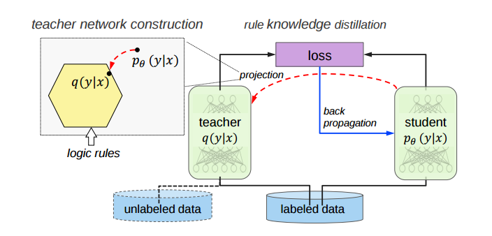
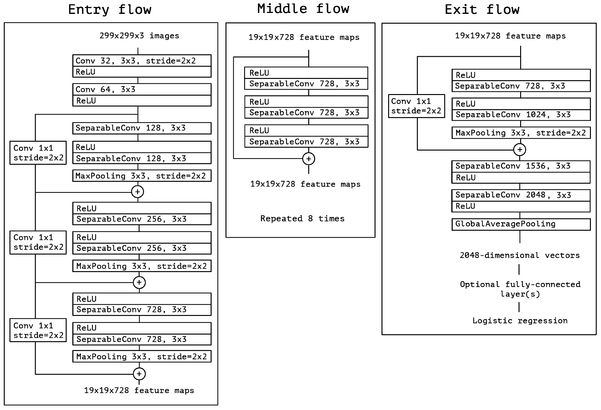
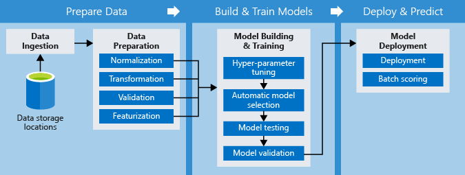
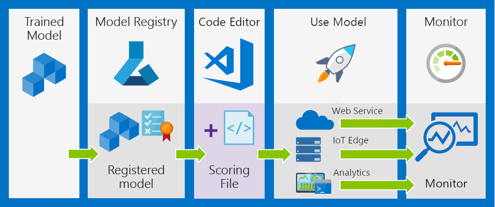

# Distilling DNNs for low-cost, high-performance deployments on the IoT edge
#
Wolfgang M. Pauli, PhD
Seth Mottadinghejad
#
### Azure AI Customer (ACE) team
#
#
Spring 2019 Machine Learning, AI & Data Science Conference

---

# Use-Case

Imagine the following scenario:

> We have a large, mostly **unlabeled image dataset** and are asked to build deep-learning object classifier that can be deployed to edge devices with **little processing power**.

---

# Challenges

- How can we train a classifier, if we only have classification labels for a small fraction of the dataset?
- How can we keep the neural network architecture small enough to work with edge devices?

---

# Approach

- We use a large neural network architecture (teacher) to teach the small network (student).
- The teacher network has been trained by somebody else on a similar dataset.
- We don't know (and we don't care!) how this teacher has been trained.

---

# Knowledge Distillation (schematic)

---

# Teacher

---

# How does this work?

1. We show an unlabeled image to the teacher network.
1. We record the probability the teacher network assignes to each classification label.
1. We optimize the student network to emulate the output off the teacher.

---

# Background

This approach is called **Knowledge Distillation**.

Early work: Buciluǎ, Cristian, Rich Caruana, and Alexandru Niculescu-Mizil. "Model compression." Proceedings of the 12th ACM SIGKDD international conference on Knowledge discovery and data mining. ACM, 2006.

Later work: Hinton, Geoffrey, Oriol Vinyals, and Jeff Dean. "Distilling the knowledge in a neural network." arXiv preprint arXiv:1503.02531 (2015).

---

# Why does this work?

- The classifier (teacher model) provides the correct answer, but also assigns probabilities to all of the incorrect answers.  
- The relative probabilities of incorrect answers tell the student mdoel a lot about how the teacher model tends to generalize. 
>An image of a BMW, for example, may only have a very small chance of being mistaken for a garbage truck, but that mistake is still many times more probable than mistaking it for a carrot.

---

# Related Approaches

## Data Distillation

In data distillation, ensembled predictions from a single model applied to multiple transformations of an unlabeled image are used as automatically annotated data for training a student model.

## Cross Modal Distillation

Cross modal distillation addresses the problem of limited labels in a certain modality.

---

# Tutorial

How to get the most out of Azure Machine Learning (AML) services to perform knowledge distillation from a teacher to a student model, to then deploy the student model for low-cost inferencing.

TODO: datastore trigger

---

# Tutorial - Tools

- Azure Machine Learning (AML)
	- Workspace - Model Management and ML Experimentation
	- Compute - Model Training with GPU
	- Pipelines - Data Prep, Feature Eng, Training, Testing
- HyperDrive - Hyperparameter tuning
- Azure Kubernetes Service - Deployment
- MLOps ML extension for Azure DevOps

---

# Tutorial - Outline

1. Create AML Workspace
1. Provision AML Compute target with GPU
1. Modify training script for compatibility with HyperDrive
1. Define AML Pipeline
	1. Modify Data Prep / Feature Eng and training scripts
	1. Define DataStore trigger to monitor for new unlabeled training data

---

# Create AML Service Workspace

- Top-level resource for Azure Machine Learning service for managing all the artifacts you create when you use Azure Machine Learning service.
- Keeps a history of:
	- training runs
	- logs
	- metrics
	- output (e.g. processed data, trained model)
	- snapshot of scripts

---

# Provision AML Compute target with GPU

- A compute target is the compute resource that you use to run your training script or host your service deployment.
- Azure Machine Learning Compute is a managed-compute infrastructure that allows the user to easily create a single or multi-node compute.
- The compute is created within your workspace region as a resource that can be shared with other users in your workspace. 

---

# Modify training script for HyperDrive

- An important aspect of machine learning is hyperparameter tuning. 
- AML's HyperDrive is a hyperparameter tuning service, offering:
	- Random, Grid and Bayesian parameter sampling
    - manages the jobs creation and monitoring process for the user
    - early termination

---

# Define AML Pipeline

# 

### Advantages of AML Pipelines:
- Unattended runs
- Mixed and diverse compute 	
- Reusability
- Tracking and versioning

---

# Setup Define DevOps environment

# 

---

# Thank You

Now that we have setup everything, we can run our training and deployement pipelines.

### Homework:
- Check whether your webservice was deployed successfully
- Add more photos to the datastore and observe what happens
- Commit a change to you training code and observe what happens

## Questions?